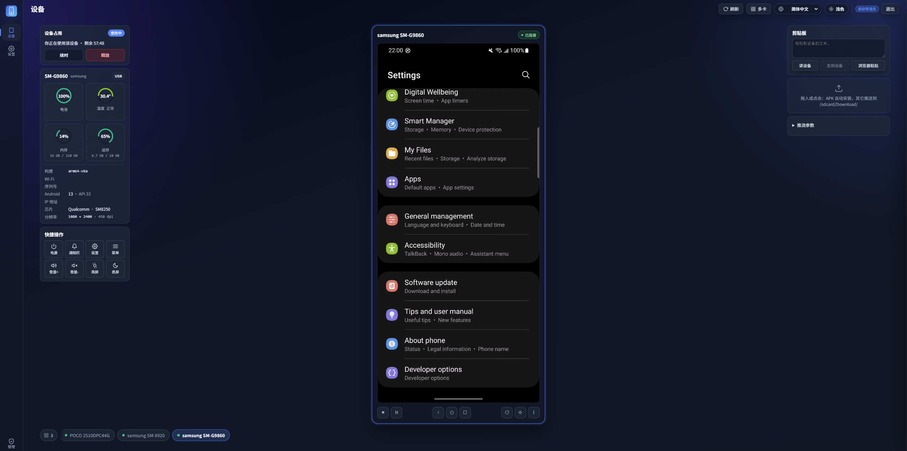
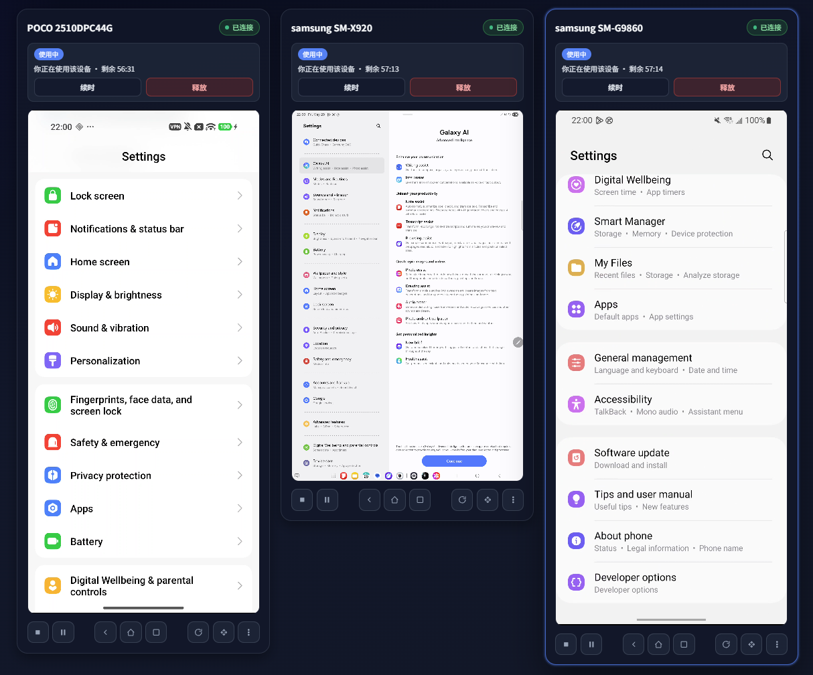
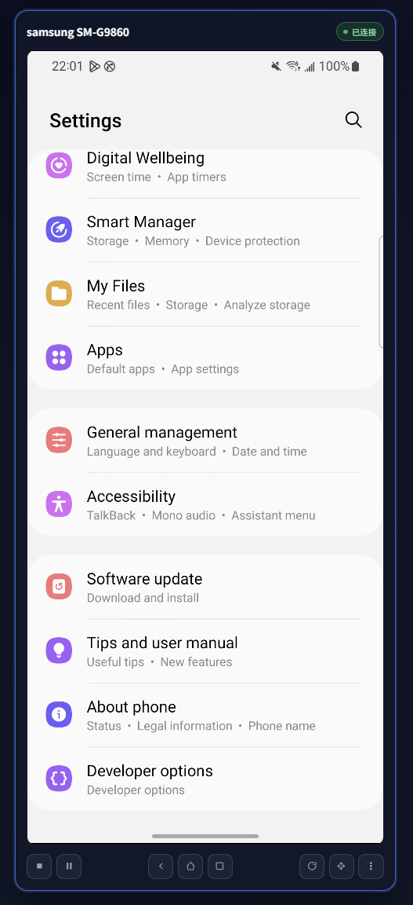

# WebAppFlaskScrcpy — 浏览器端 Android 远程镜像与控制平台

<div align="center">


**基于 WebRTC 的低延迟 Android 投屏 / 控制 / 运维平台**

[](https://python.org)
[](https://flask.palletsprojects.com)
[](https://vuejs.org)
[](https://github.com/aiortc/aiortc)
[](LICENSE)

[中文](README.md) • [English](README_en.md)

[功能特性](#功能特性) • [快速开始](#快速开始) • [安全设计](#安全设计) • [API 文档](#api-文档) • [部署指南](#部署指南)

</div>

## 项目简介

WebAppFlaskScrcpy 是一个**纯浏览器**的 Android 远程镜像与控制平台。无需安装客户端，打开网页即可实时镜像手机画面、远程触控/输入、传输文件、查看日志、管理应用，并提供内嵌的 ADB 终端。

与传统 scrcpy 不同，本项目把视频、输入、文件三条**数据平面**全部跑在 **WebRTC**（RTP + DataChannel）之上，Socket.IO 仅用于信令、终端与 REST 风格的 HTTP 接口，从而在浏览器中获得接近原生的低延迟体验，并天然支持局域网内多人、多设备访问。

在镜像能力之上，平台内置了一套完整的**账号体系**与**设备占用（预约）机制**，使其可以作为团队共享的设备运维台：谁在用哪台设备一目了然，管理员可强制释放、管理用户。

## 界面展示

<div align="center">

**主界面**



**多设备展示效果**



**单设备展示效果**



</div>

## 项目立项背景

### 行业背景

移动端测试、运维、演示场景中，远程操控真机是高频需求。传统方案存在明显痛点：

- **客户端依赖重**：scrcpy / 各类投屏工具需在每台操作机安装客户端、配 adb，门槛高。
- **多人协作混乱**：一台真机被多人争抢，缺乏占用与排他机制，互相打断。
- **缺乏权限边界**：谁都能连、谁都能控，没有账号与角色，运维不可审计。
- **跨平台割裂**：Windows / macOS / Linux 上的启动、adb、进程管理各不相同。

### 项目目标

1. **零客户端**：浏览器即操作台，局域网内任意设备可访问。
2. **低延迟**：视频/输入/文件走 WebRTC，体验接近本地连接。
3. **可管控**：账号 + 角色 + 设备占用，让真机成为可调度、可审计的共享资源。
4. **跨平台**：一套代码在 Windows / macOS / Linux 上一键启动，自带各平台 adb。

## 解决的实际痛点

### 1. 远程操控门槛高

**痛点**：每台操作机都要装 scrcpy、配置 adb、处理驱动。

**方案**：服务端集中接入 adb 与 scrcpy-server，操作端只需浏览器；服务端首启自动从 `resources/re_adb/` 释放对应平台的 platform-tools 并加入 PATH（`services/adb_bootstrap.py`）。

### 2. 多人争抢同一台设备

**痛点**：真机资源稀缺，多人同时连接互相干扰，无法排他。

**方案**：**设备占用（预约）机制**——用户按需占用设备一段时间，期间仅占用者可控制；支持本人主动释放、到期自动回收、管理员强制释放（`services/reservations.py`）。

### 3. 没有权限与审计

**痛点**：无账号体系，谁都能连、不可控、不可查。

**方案**：内置三级角色账号体系（超级管理员 / 管理员 / 普通用户）、服务端会话、统一登录闸门、管理员用户管理面板。

### 4. 安全暴露面大

**痛点**：登录接口易被暴力破解；输入未校验易被注入/滥用。

**方案**：参数化 SQL、加盐口令哈希、可吊销的服务端会话、**登录失败锁定**、**输入校验**、**防账号枚举**（详见[安全设计](#安全设计)）。

### 5. 跨平台运行差异

**痛点**：进程/端口管理、venv 布局、adb 二进制在三大系统上都不一样。

**方案**：`start_dev.py` 一键启动器按操作系统分支（端口清理、进程组、venv 路径）；adb 自带三平台包并自动恢复可执行位 / 去 macOS 隔离属性。

## 项目实现原理

### 核心架构

```
浏览器 (Vue3 SPA)
   │  HTTP / Socket.IO(长轮询)               WebRTC (RTP + DataChannel)
   ▼                                              ▼
Flask + Flask-SocketIO  ──信令──►  aiortc (asyncio 线程)  ──►  scrcpy-server (设备端)
   │                                              ▲
   │  REST: 设备/账号/占用/文件/应用/日志          │ adb (adbutils)
   ▼                                              │
SQLite (账号/会话/设备占用)               Android 设备 (USB/TCP)
```

- **为什么用 threading 而非 eventlet**：aiortc 运行在独立 asyncio 线程，需要真实 OS socket；eventlet 的 monkey-patch 会劫持全局 socket 导致 asyncio selector 死锁。因此 Socket.IO 采用 `async_mode="threading"`，并强制信令走 HTTP 长轮询（Werkzeug + threading 无法干净完成 WebSocket 升级），重数据平面交给 WebRTC 自己的 RTP/DataChannel。
- **三条数据平面全走 WebRTC**：视频（H.264 RTP）、输入（不可靠 DataChannel）、文件（可靠 DataChannel）。
- **设备接入**：`scrcpy/` 是精简移植的 scrcpy 客户端（`scrcpyclients` / `scrcpycore` / `scrcpycontrol` / `scrcpyconst` / `scrcpynetwork`），通过 adbutils 推送并启动设备端 scrcpy-server。
- **内嵌终端**：直接走 adb `shell:v2` 协议裸 socket，PTY 在设备端，宿主侧不依赖 `pty`/`winpty`，天然跨平台（`terminal/adb_shell.py`）。

### 设备占用模型

- `device_id` 为预约表主键 → 利用 UNIQUE 约束解决并发抢占（败者得到 IntegrityError 而非半成功）。
- 三释放路径统一走 `release()`：本人取消 / 管理员强制 / 到期清扫线程回收。
- 每次释放都执行 `_teardown`：停 scrcpy 客户端 → 关该设备所有 WebRTC peer → 广播 `device_released`，确保设备真正空闲。
- **三面闸门**：HTTP（`api/devices.py` 的 `_require_owner`）、WebRTC（`webrtc:offer`）、终端（`terminal:open`）全部调用 `reservations.assert_owner`——只守 HTTP 会被另外两条平面绕过。

## 项目框架

```
WebAppFlaskscrcpy/
├── app.py                    # Flask + Socket.IO 入口；蓝图注册、登录闸门、SPA 托管
├── start_dev.py              # 跨平台一键启动器（后端 5001 + Vite 5173）
├── requirements.txt          # Python 依赖（UTF-8）
├── api/                      # HTTP / Socket.IO 路由（薄适配层）
│   ├── authentication.py     #   登录/注册/会话/用户管理 + 登录失败锁定
│   ├── reservations.py       #   设备占用 REST
│   ├── devices.py            #   设备列表/启停/输入/文件/应用/日志
│   ├── streams.py            #   推流配置/自适应/快照
│   └── webrtc.py             #   WebRTC 信令（offer/ice/close）
├── services/                 # 业务逻辑层
│   ├── database.py           #   SQLite 连接与建表/种子账号
│   ├── authentication.py     #   口令哈希、会话令牌、角色装饰器
│   ├── validators.py         #   ★可复用：用户名/邮箱/密码校验（单一来源）
│   ├── rate_limit.py         #   ★可复用：限流器 + 限流装饰器（防暴破）
│   ├── reservations.py       #   设备占用：claim/release/sweep/assert_owner
│   ├── adb_bootstrap.py      #   自带 adb 释放与 PATH 注入（跨平台）
│   ├── webrtc_session.py     #   WebRTC 会话编排
│   ├── quality_controller.py #   自适应抗花屏控制
│   └── ...                   #   设备信息/文件/上传/日志/输入等
├── scrcpy/                   # 精简移植的 scrcpy 客户端
│   ├── scrcpyclients.py / scrcpycore.py / scrcpycontrol.py
│   ├── scrcpyconst.py / scrcpynetwork.py
│   └── webrtc/               #   aiortc 管线（peer_manager / video_track / ...）
├── terminal/                 # 内嵌 ADB 终端（shell:v2 over socket）
├── frontend/                 # Vue 3 + Vite 前端（构建产物在 dist/，由 Flask 托管）
│   └── src/
│       ├── components/       #   LoginView / AdminPanel / ThemeToggle / DeviceCard ...
│       ├── composables/      #   useAuth / useReservations / useValidators / useAppContext ...
│       └── locales/          #   en / zh-CN / zh-TW 三语
├── scripts/
│   └── init_db.py            # 数据库工具：init / clear / reset / status / backup
├── resources/
│   ├── re_adb/               #   adb解压后运行路径
│   └── runpath/              #   首启释放后的 adb
├── tests/                    # pytest 白盒测试
└── data/                     # SQLite 数据库 (app.db)
```

## 功能特性

### 远程镜像与控制
- WebRTC 低延迟投屏（H.264），单设备舞台视图 / 多设备网格视图自适应
- 触控、滑动、按键、文本输入、旋转、息屏/亮屏、快捷按键
- 剪贴板双向同步、文件拖拽上传/推送、APK 安装

### 设备运维
- 文件浏览器（增删改查、上传下载）、应用管理（列举/卸载/导出 APK）
- 实时 logcat（SSE 流）、设备信息面板
- 内嵌 ADB 终端（xterm.js，真实 PTY）

### 账号与占用
- 三级角色：超级管理员 / 管理员 / 普通用户；普通用户自助注册
- 设备占用：选时长占用、本人释放、到期自动回收、管理员强制释放
- 管理员面板：建号 / 改邮箱 / 重置密码 / 改角色 / 启停 / 删除、设备占用总览

### 体验
- 明 / 暗主题切换（登录页与主界面共用同一组件）
- 中文（简/繁）/ 英文 三语
- 推流参数与自适应抗花屏

## 技术架构

### 后端技术栈
- **Python 3.10+**（开发于 3.13）
- **Flask 3.1** + **Flask-SocketIO 5.5**（`async_mode="threading"`）
- **aiortc 1.14**（WebRTC）+ **av** + **opencv-python**（视频处理）
- **adbutils**（adb 接入）、**Werkzeug**（口令哈希）
- **SQLite**（账号 / 会话 / 设备占用，单文件，无外部依赖）

### 前端技术栈
- **Vue 3** + **Vite 6** SPA
- **socket.io-client**、**@xterm/xterm**（终端）
- 组件化设计 + composables；i18n / 主题自管理

## 快速开始

### 环境要求
- Python 3.10+
- Node.js 18+（构建/开发前端）
- adb：可选，未安装会自动从 `resources/re_adb/` 释放对应平台版本

### 安装

```bash
# 1) 后端依赖（建议虚拟环境）
python -m venv .venv
# Windows
.venv\Scripts\activate
# macOS / Linux
source .venv/bin/activate
pip install -r requirements.txt

# 2) 前端依赖与构建
cd frontend
npm install
npm run build        # 生成 dist/，由 Flask 托管
cd ..

# 3) 初始化数据库（首次必做）
python scripts/init_db.py init
```

### 启动

```bash
# 方式 A：一键启动器（后端 5001 + Vite 5173，自动开浏览器）
python start_dev.py
#   python start_dev.py stop          # 仅清理端口
#   python start_dev.py start --local-only   # 仅本机 127.0.0.1，不暴露局域网
#   python start_dev.py start --no-browser   # 不自动开浏览器

# 方式 B：仅后端（直接托管已构建的前端 dist）
python app.py
```

打开 `http://localhost:5173`（开发）或 `http://localhost:5001`（仅后端），使用预置账号登录。

### 后端 / 前端命令

**后端**（仓库根目录，已激活 venv）：

```bash
python app.py                  # 启动后端，托管已构建的前端 dist，默认 :5001
python start_dev.py            # 一键同时拉起 后端(:5001) + 前端 Vite(:5173)
python scripts/init_db.py init # 数据库工具：init / status / clear / reset / backup
python -m pytest tests/ -q     # 运行后端白盒测试
```

**前端**（`frontend/` 目录）：

```bash
npm install         # 安装依赖
npm run dev         # Vite 开发服务器（:5173，热更新，代理 /api 与 /socket.io 到 :5001）
npm run build       # 生产构建 → dist/（由 Flask 托管）
npm run preview     # 本地预览构建产物
npm run test        # vitest 单测（npm run test:watch 监听模式）
npm run check:i18n  # 校验三语 i18n key 完整性
npm run format      # Prettier 格式化（npm run format:check 仅检查）
```

> 开发期推荐 `python start_dev.py`：同时起后端与 Vite，改前端代码即时热更新（后端代码改动需重启）。仅部署/演示时用 `python app.py` 直接托管已构建的 `dist/`。

### 预置账号

| 角色    | 用户名          | 密码              | 说明                 |
|-------|--------------|-----------------|--------------------|
| 超级管理员 | `superadmin` | `superadmin123` | 兜底账号，不可被删除/停用      |
| 管理员   | `admin`      | `admin123`      | 可管理普通用户、强制释放设备     |
| 普通用户  | `user1`      | `User123456`    | 示例普通用户；也可通过注册页自助创建 |

> **自助注册口令策略**：用户名 **3–32 位、以字母或数字开头**（仅含字母 / 数字 / `.` `_` `-`）；密码 **8–128 位且需同时包含字母与数字**。规则前后端同源（`services/validators.py` ↔ `frontend/src/composables/useValidators.js`）。

> ⚠️ **正式使用前请务必修改预置口令**（登录后「修改密码」，或管理员重置）。

## 配置说明

通过环境变量配置（启动前设置）：

| 变量                 | 默认     | 说明                                |
|--------------------|--------|-----------------------------------|
| `FLASK_SECRET_KEY` | 随机     | 会话 Cookie 签名密钥；生产务必固定，否则重启即失效全部会话 |
| `HOST`             | 局域网 IP | 后端绑定地址（`app.py`）                  |
| `PORT`             | `5001` | 后端端口                              |
| `OPEN_BROWSER`     | `1`    | 是否自动开浏览器（`0` 关闭）                  |
| `ENABLE_WEBRTC`    | `1`    | WebRTC 信令开关（`0` 强制关闭）             |
| `ENABLE_TERMINAL`  | `1`    | 内嵌终端开关                            |

会话有效期、占用时长上限等在代码常量中（`services/authentication.py`、`services/reservations.py`）。

## 安全设计

> 登录/注册的安全规则参照 OWASP ASVS 与 Django 校验器实践设计。

| 项目           | 实现                                                                                                        |
|--------------|-----------------------------------------------------------------------------------------------------------|
| **SQL 注入**   | 全部参数化查询（`?` 占位）；唯一的动态 `UPDATE` 拼接的是代码固定的列名片段，值仍参数化                                                        |
| **口令存储**     | Werkzeug `generate_password_hash` + 每用户独立随机 salt；从不明文存储                                                   |
| **会话**       | 服务端 `user_sessions` 表存令牌（`secrets.token_urlsafe`），Cookie 仅携带不透明令牌；可被管理员/改密吊销；重启清空强制重登                     |
| **登录闸门**     | `app.py` 的 `before_request` 统一拦截 `/api/`，仅放行登录/注册/检查鉴权                                                    |
| **暴力破解**     | `services/rate_limit.py` 失败计数：按 `ip+用户名` 连续失败达阈值后锁定一段时间（默认值见 `api/authentication.py`，可调），成功即清零            |
| **输入校验**     | `services/validators.py` 单一来源 + 前端 `useValidators` 镜像：用户名 3–32 位字母/数字开头白名单字符、邮箱长度上限+小写归一、密码 8–128 且含字母与数字 |
| **防账号枚举**    | 登录失败统一返回「用户名或密码错误」，不暴露账号是否存在                                                                              |
| **XSS 纵深防御** | 用户名白名单挡掉空格/控制符/HTML；前端 Vue 自动转义                                                                           |
| **三面授权**     | 设备控制在 HTTP / WebRTC / 终端三条平面均校验占用归属                                                                       |

## 使用指南

1. **登录 / 注册**：浏览器打开后进入登录页；新用户点「注册」自助创建（受口令策略约束）。
2. **占用设备**：在设备舞台左侧「设备占用」卡片选择时长并占用；占用后方可控制。
3. **镜像与控制**：点设备卡「开始推流」即开始投屏；支持触控、输入、文件拖拽、剪贴板、终端等。
4. **释放设备**：本人可随时「释放」；到期自动回收。
5. **管理员**：右上角「管理」打开面板——用户管理（建号/改邮箱/重置密码/改角色/启停/删除）与设备占用总览（强制释放）。

## API 文档

### 认证与用户（`/api/auth/*`）
| 方法     | 路径                            | 权限  | 说明                            |
|--------|-------------------------------|-----|-------------------------------|
| POST   | `/api/auth/register`          | 公开  | 注册（角色固定为 user）                |
| POST   | `/api/auth/login`             | 公开  | 登录（含失败锁定）                     |
| POST   | `/api/auth/logout`            | 登录  | 登出                            |
| GET    | `/api/auth/check-auth`        | 公开  | 查询登录态                         |
| GET    | `/api/auth/profile`           | 登录  | 当前用户信息                        |
| POST   | `/api/auth/change-password`   | 登录  | 改密（吊销全部会话）                    |
| GET    | `/api/auth/users`             | 管理员 | 用户列表（super 看全部，admin 仅看 user） |
| POST   | `/api/auth/users`             | 管理员 | 创建用户                          |
| PUT    | `/api/auth/users/<id>`        | 管理员 | 改邮箱/角色/密码/启停                  |
| POST   | `/api/auth/users/<id>/active` | 管理员 | 启用/停用                         |
| DELETE | `/api/auth/users/<id>`        | 管理员 | 删除                            |

### 设备占用（`/api/reservations*`）
| 方法     | 路径                              | 说明                       |
|--------|---------------------------------|--------------------------|
| GET    | `/api/reservations`             | 占用列表 + 最大/默认时长           |
| POST   | `/api/reservations`             | 占用设备（device_id, minutes） |
| DELETE | `/api/reservations/<device_id>` | 释放（本人或管理员强制）             |

### 设备 / 流（`/api/*`，均需登录 + 占用归属）
`GET /api/devices`、`POST /api/start`、`POST /api/stop`、`POST /api/upload`、
`/api/device/<id>/{info,keyevent,swipe,rotate,logcat,files,apps,...}`、
`/api/{scrcpy-server,stream-config,reconfigure,adaptive,snapshot,active-streams}`。

### Socket.IO 事件
- WebRTC 信令：`webrtc:offer` / `webrtc:ice` / `webrtc:close`（→ `webrtc:answer` / `webrtc:ice` / `webrtc:closed`）
- 终端：`terminal:open` / `terminal:input` / `terminal:resize` / `terminal:close`（→ `terminal:opened/output/closed/error`）
- 广播：`devices_changed` / `reservation_changed` / `device_released` / `scrcpy_status`

## 数据库工具

```bash
python scripts/init_db.py init      # 建表 + 写入预置账号（幂等）
python scripts/init_db.py status    # 查看账号 / 占用 / 文件大小
python scripts/init_db.py clear     # 清运行态数据（会话/占用/已注册用户），保留预置账号
python scripts/init_db.py reset     # 删表重建并重新写入预置账号（危险）
python scripts/init_db.py backup    # 时间戳备份 data/app.db
```

## 测试

```bash
# 全量白盒测试（pytest）
python -m pytest tests/ -q
```

覆盖范围：账号全链路（注册/登录/登出/鉴权）、口令策略与校验器、登录失败锁定、角色可见性与管理约束、设备占用生命周期（claim/续期/竞态/过期/sweep）、三面授权闸门、占用 HTTP 路由、`init_db` 工具等。

## 部署指南

- **开发**：`python start_dev.py`（Werkzeug 开发服务器，仅供开发）。
- **生产**：本项目内置的是开发服务器。生产建议使用真正的 WSGI 服务器，并将 aiortc 子进程分离部署（参见 `docs/`）。务必设置固定的 `FLASK_SECRET_KEY`、修改预置口令、按需用 `--local-only` 或反向代理限制暴露面。

## 跨平台说明

- **Windows / macOS / Linux 均支持**：`resources/re_adb/` 内置三平台 platform-tools，首启自动释放（POSIX 恢复可执行位、macOS 去隔离属性）。
- `start_dev.py` 按 OS 分支：端口清理（Windows PowerShell/`netstat` vs POSIX `lsof`）、进程组（`CREATE_NEW_PROCESS_GROUP` vs `setsid`）、venv 路径（`Scripts` vs `bin`）。
- 内嵌终端走 adb `shell:v2`，不依赖宿主 PTY，三系统一致。

## 故障排除

- **前端 503 / 找不到 dist**：先 `cd frontend && npm run build`。
- **未检测到设备**：确认 `adb devices` 可见、USB 调试已开；首启会自动释放自带 adb。
- **重启后需重新登录**：未设置 `FLASK_SECRET_KEY`（随机密钥每次重启变化）+ 启动会清空会话，属预期；设置固定密钥可缓解（仍会清会话）。
- **登录被锁定 429**：连续失败触发暴破锁定，等待提示的冷却时间或由管理员处理。
- **日志**：见 `logs/` 目录。

---

如需把限流装饰器挂到更多接口、调整锁定阈值/占用时长、或扩展角色权限，相关规则均已抽成可复用模块（`services/validators.py`、`services/rate_limit.py`），改一处即可全局生效。
